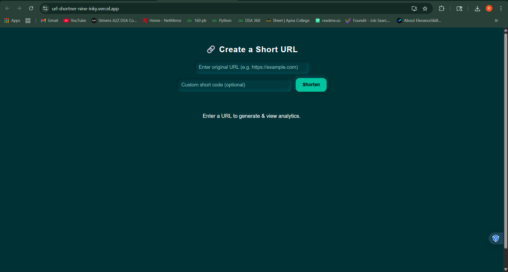
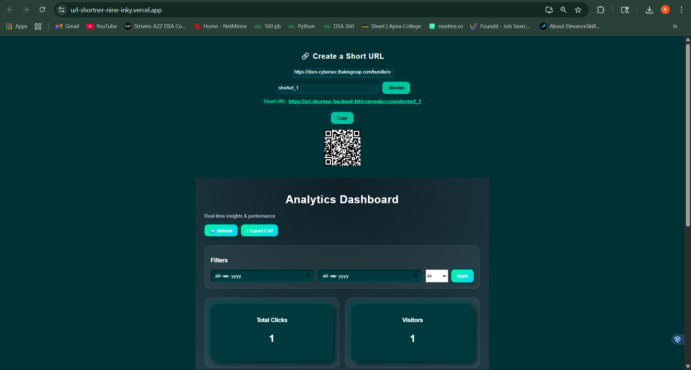
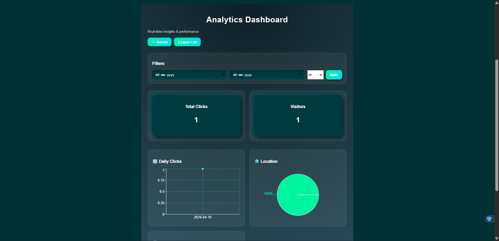

# URL Shortener with Real-Time Analytics

A **production-grade full-stack URL shortener** designed with scalability, performance, and real-world backend architecture in mind.  
This project demonstrates **low-latency systems, asynchronous processing, and analytics pipelines** similar to large-scale services.

---

## Deployment

**Live Demo**
https://url-shortner-nine-inky.vercel.app/  

---

## Screenshots

| Home Page | Dashboard | Analytics |
|-----------|--------------------|-------------|
|  |  |  |

---

## Features

### URL Shortening

- Generate short URLs instantly  
- Support for custom short codes  
- High-speed redirection using Redis caching  

---

### Real-Time Analytics

- Track total clicks and unique visitors  
- Daily click trends visualization  
- Browser-based analytics (Chrome, Edge, etc.)  
- Location-based insights  
- Interactive dashboards using charts  

---

### Performance & Scalability

- Redis caching for ultra-fast URL resolution  
- Queue-based architecture for handling high traffic  
- Asynchronous background processing using workers  
- Optimized MongoDB aggregation queries  

---

### Data Export

- Export analytics data as CSV  
- Filtered export by date and browser  

---

### Modern UI

- Glassmorphism-inspired design  
- Smooth animations using Framer Motion  
- Fully responsive across devices  

---

## Performance Highlights

- Reduced URL lookup latency using Redis caching  
- Non-blocking request handling via queue-based processing  
- Efficient analytics aggregation using MongoDB pipelines  
- Designed to handle high-frequency read/write operations  

---

## Tech Stack

### Frontend

- React.js  
- Axios  
- Recharts  
- Framer Motion  

### Backend

- Node.js  
- Express.js  
- MongoDB (Mongoose)  

### Infrastructure

- Redis (Upstash)  
- Bull (Queue system)  
- MongoDB Atlas  
- Render (Backend Deployment)  
- Vercel (Frontend Deployment)  

---

## Architecture Overview

```
Client (React - Vercel)
        ↓
API Layer (Node.js - Render)
        ↓
Cache Layer (Redis - Upstash)
        ↓
Queue System (Bull)
        ↓
Worker Service (Async Processing)
        ↓
Database (MongoDB Atlas)
```

---

## System Workflow

1. User submits a long URL  
2. Backend generates a unique short ID  
3. URL mapping stored in MongoDB  
4. Frequently accessed URLs cached in Redis  

### When a short link is accessed:

- Instant redirect using Redis (low latency)  
- Click event pushed to queue (non-blocking)  
- Worker processes analytics asynchronously  
- Data aggregated and stored in MongoDB  
- Dashboard fetches and visualizes insights  

---

## Engineering Decisions

- **Redis Caching** → Reduces database load and improves response time  
- **Queue System (Bull)** → Prevents request blocking under high traffic  
- **Worker Architecture** → Ensures scalable background processing  
- **Aggregation Pipelines** → Efficient analytics computation  

---

## Why This Project

This project was built to simulate **real-world backend engineering challenges**, including:

- Designing low-latency systems  
- Handling concurrent user traffic  
- Implementing non-blocking architectures  
- Building scalable analytics pipelines  

It reflects practical system design concepts used in production-grade applications.

---

## Setup Instructions

### 1. Clone Repository

```bash
git clone https://github.com/Rachit753/url-shortener.git
cd url-shortener
```

---

### 2. Backend Setup

```bash
cd backend
npm install
```

Create `.env` file:

```
PORT=5000
MONGO_URI=your_mongodb_uri
REDIS_URL=your_redis_url
BASE_URL=http://localhost:5000
```

Run backend:

```bash
npm run dev
```

---

### 3. Frontend Setup

```bash
cd frontend
npm install
```

Create `.env` file:

```
REACT_APP_API_URL=http://localhost:5000
```

Run frontend:

```bash
npm start
```

---

## Environment Variables

- `MONGO_URI` → MongoDB connection string  
- `REDIS_URL` → Redis (Upstash) connection  
- `BASE_URL` → Backend base URL  
- `REACT_APP_API_URL` → Frontend API URL  

---

## Future Improvements

- Distributed rate limiting using Redis  
- Custom domain support  
- Link expiration & password protection  
- Event streaming (Kafka) for real-time analytics  
- Scalable sharding strategy for large datasets  

---

## Author

**Rachit Chauhan**  
Backend / Full Stack Developer  

- GitHub: https://github.com/Rachit753 
- LinkedIn: https://www.linkedin.com/in/rachit-chauhan/ 

---

## Show Your Support

If you found this project useful, consider giving it a ⭐ on GitHub!